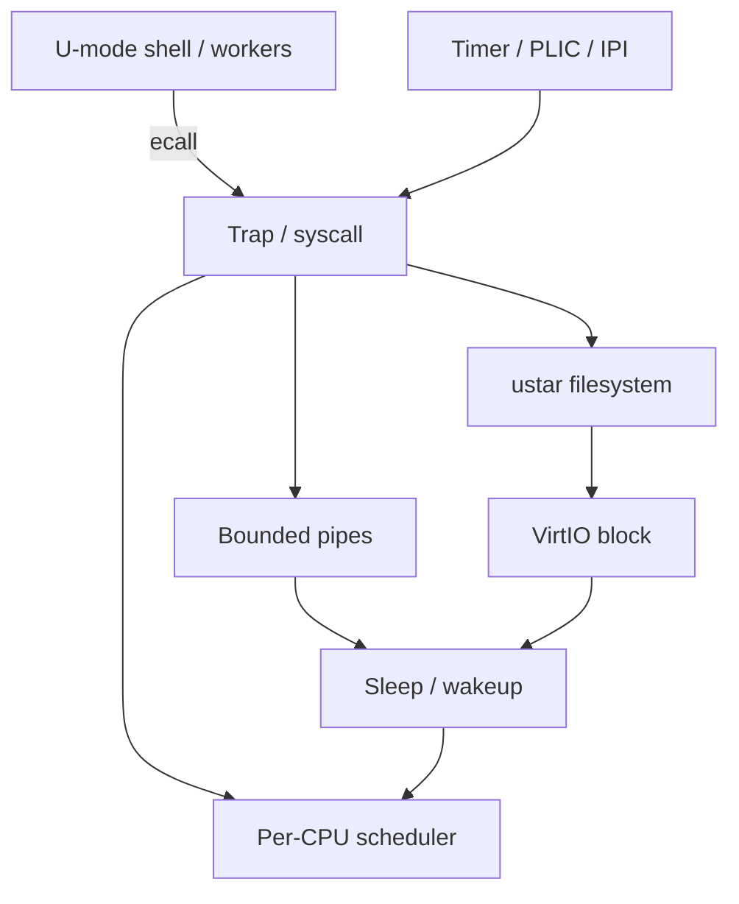

# RVKernel Lab

**从启动、页表和用户态，学到设备中断、抢占调度、进程通信与多核同步。**

运行于 QEMU `virt` / RV32，使用 C 和少量汇编。项目从 [Operating System in 1,000 Lines](https://operating-system-in-1000-lines.vercel.app/en/) 的实践代码起步，在基础内核之上扩展设备中断、用户态抢占、进程间管道和 SMP，并提供可复现自测。

## 从这里开始学习

**[进入完整教程 →](docs/tutorial/README.md)**

课程采用“问题 → 原理 → 源码导读 → 动手实验 → 验收与思考”的结构。当前提供完整参考实现上的分章学习与实验；基础章节可回看 Git 历史，四项扩展尚未拆成逐章可编译版本。

| 学习阶段 | 课程入口 | 学习成果 |
| --- | --- | --- |
| 第一次运行 | [00 环境与启动](docs/tutorial/00-getting-started.md) | 区分固件、内核和用户程序，完成自测 |
| 基础内核 | [01 启动](docs/tutorial/01-boot.md) · [02 内存](docs/tutorial/02-memory.md) · [03 进程](docs/tutorial/03-processes.md) · [04 文件系统](docs/tutorial/04-filesystem.md) | 追踪程序从镜像到运行、再到系统调用和 I/O |
| 并发基础 | [05 Trap、锁与阻塞](docs/tutorial/05-traps-and-sleep.md) | 解释可信现场、状态切换与丢失唤醒 |
| 四项扩展 | [06 中断](docs/tutorial/06-interrupts.md) · [07 抢占](docs/tutorial/07-preemption.md) · [08 IPC](docs/tutorial/08-pipes.md) · [09 SMP](docs/tutorial/09-smp.md) | 理解实现步骤，设计能证明功能的实验 |
| 综合实践 | [10 验证与毕业实验](docs/tutorial/10-capstone.md) | 完成一项改进和可复现报告 |

初学者按顺序阅读；已有内核基础可从第 05 课开始。每课给出源码入口、练习与验收标准，参考答案折叠展示。新增作业的预期结果与已有回归证据明确区分。

## 来源与项目增量

项目围绕教程 [Features not implemented](https://operating-system-in-1000-lines.vercel.app/en/03-overview#features-not-implemented) 列出的四项缺口展开：轮询 I/O → 设备中断，协作调度 → 用户态定时器抢占，无 IPC → 具名管道，单处理器 → 最多 4 hart SMP。IPC 扩展当前不包含 UNIX domain socket 和共享内存。

保留仓库原有章节式提交，便于查看学习路径。基础实现与后续扩展的分界是本仓库提交 `6f2b063`（`16.文件系统`）。下表说明实现范围；不将教程基础功能作为独立原创成果。

| 范围 | 内容 | 源码入口 |
| --- | --- | --- |
| 教程基础 | 启动、上下文切换、Sv32 页表、用户态、syscall、shell、磁盘与 ustar 文件系统 | `kernel.c`、`user.c`、链接脚本 |
| 中断扩展 | PLIC 分发、UART RX 缓冲、VirtIO 完成中断与阻塞等待 | `external_handle_irq`、`read_write_disk` |
| 调度扩展 | SBI TIME 10 ms tick、用户态抢占、sleep/wakeup | `handle_trap`、`scheduler` |
| IPC 扩展 | 8 个具名管道、256 字节环形缓冲、阻塞、short I/O、EOF、断管处理 | `pipe_read_sys`、`pipe_write_sys` |
| 多核扩展 | 1～4 hart、SBI HSM 启动、每核状态、每 PCB 锁、IPI 唤醒 | `start_secondary_harts`、`sched` |
| 教学与验证 | 11 节课程、分项自测、串口回归、综合作业和演示流程 | `shell.c`、`scripts/smoke.py`、`docs/tutorial/` |

## 快速运行

需要 Clang/LLVM（含 LLD、llvm-objcopy）、QEMU RISC-V 和 Bash。macOS Homebrew 环境可用 `brew install llvm qemu` 安装工具链。

```sh
bash run.sh                 # 默认 2 核，编译并启动
NCPU=4 bash run.sh          # 可选 1、2、3、4 核
```

脚本优先使用现有 Homebrew LLVM，否则从 PATH 查找；也可通过 `CC`、`OBJCOPY`、`QEMU` 指定工具。当前实测环境是 macOS / Homebrew，其他环境需自行验证工具链和 OpenSBI。

进入 shell 后输入：

```text
help
hello
irqstat
selftest
irqstat
```

自测会逐项打印 `[PASS]`，全部通过后输出 `SELFTEST PASS`。`exit` 结束 shell；退出 QEMU 请按 **Ctrl-a，再按 x**。

## 可复现验证

可选回归工具只需要 Python 3 标准库：

```sh
python3 scripts/smoke.py                  # 顺序构建、验证 1/2/4 核
python3 scripts/smoke.py --cpus 4          # 单独验证 4 核
```

脚本检查启动核数、help、hello、自测和统计输出，失败或超时返回非零状态，串口记录保存在 `test-results/`。不要同时启动多个构建：构建产物和磁盘镜像位于仓库根目录。

自测验证 tick 前进、磁盘完成中断、文件系统总容量及拒绝写入后的数据完整性、3 KiB 管道数据及 EOF、同核抢占和各核 affinity。它不是性能基准，也不覆盖所有竞态。详细证据见 [验证记录](docs/VALIDATION.md)。

## 架构与设计取舍



重点设计问题是：trap 如何切换到可信栈、条件锁如何避免丢失唤醒、PCB 锁如何跨上下文切换交接，以及其他 hart 如何被唤醒。参阅 [实现与面试讲解](docs/IMPLEMENTATION_AND_INTERVIEW_GUIDE.md) 和 [三分钟演示](docs/DEMO.md)。

## 当前边界与后续方向

- 普通内核路径不可抢占；UART TX 仍为短轮询，块设备同时只有一个在途请求。
- 没有完整 POSIX、`fork/exec`、物理页完整回收、动态 TLB shootdown 或完整负载均衡。
- 文件系统是简化内存 ustar 模型；每次 `run.sh` 都从 `disk/*.txt` 重建镜像。自测不证明重启持久化或崩溃一致性。
- 每文件上限 1024 字节，全部文件加 tar 头和扇区填充还必须装入 2560 字节缓冲区；超出总容量的写入返回 -1，并保持原内容不变。
- MMIO 地址和时钟频率绑定当前 QEMU 配置，尚未在真实硬件上验证。
- 下一步：补齐断管/资源耗尽回归，增加调度延迟测量，再考虑物理页回收。上述项目均为计划，不能作为已实现能力。

## 仓库导航与贡献

内核位于 `kernel.c/h`，用户运行时位于 `user.c/h`，共享工具位于 `common.c/h`，演示程序位于 `shell.c`，镜像输入位于 `disk/`。保留平铺布局以方便阅读。修改后运行 `bash run.sh`，涉及并发路径时再运行多核回归。不要提交生成的 ELF、镜像或日志。

## 致谢

感谢 Seiya Nuta 的 [Operating System in 1,000 Lines](https://operating-system-in-1000-lines.vercel.app/en/) 及其[源码仓库](https://github.com/nuta/operating-system-in-1000-lines)。教程声明文字采用 CC BY 4.0、实现示例与正文源码采用 MIT；上游版权和许可声明应随对应代码保留。本 README 记录来源，不替整个仓库新增统一许可声明。
