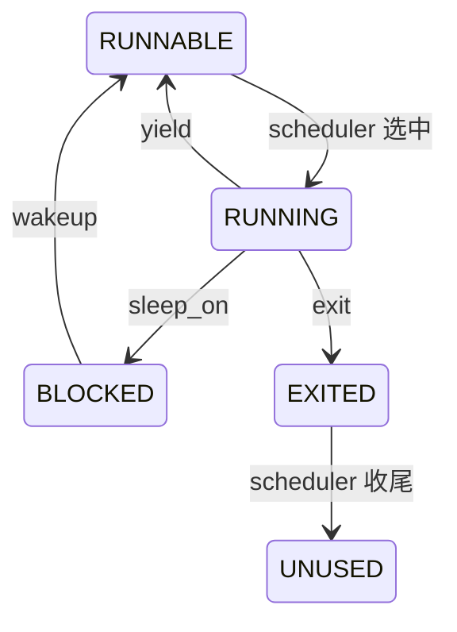

# 05 四项扩展共用的基础：Trap、锁和阻塞

[上一课](04-filesystem.md) · [课程目录](README.md) · [下一课](06-interrupts.md)

## 本课目标

解释两个不变量：进入内核后必须使用可信现场；条件检查和进入睡眠之间不能漏掉唤醒。阅读 [kernel.c](../../kernel.c) 的 `kernel_entry`、`handle_trap`、`push_off`、`acquire`、`sleep_on`、`wakeup`。

## 第一步：保住被打断的现场

U-mode 运行时，本项目用 `sscratch` 保存可信内核栈顶。trap 入口交换 `sp` 和 `sscratch`，在内核栈建立 144 字节 frame，保存用户寄存器，再建立内核 `gp` 和可信 CPU 指针 `tp`。进入 C 前将 `sscratch` 清零。

S-mode trap 通过零值约定继续使用内核栈；判断异常来源使用保存的 `sstatus.SPP`。不能相信用户提供的 `tp`，也不能用用户 `sp` 的数值判断权限来源。阅读时同时对照 [kernel.h](../../kernel.h) 的 `trap_frame` 字段顺序和汇编偏移。

## 第二步：锁保护什么

关闭本 hart 中断，避免本核持锁期间 ISR 再拿同一把锁；原子操作使其他 hart 不能同时进入临界区。只关本核中断无法约束另一核，只有普通变量也不能替代原子锁。

`push_off/pop_off` 记录每核嵌套深度和进入前的中断状态，避免内层解锁提前打开中断。不要在持锁位置随意插入大量打印：输出也有锁，还会改变调度时序。

## 第三步：原子衔接条件与睡眠

下面是错误时序，用来分析，不要写入内核：

```text
reader: 发现缓冲区为空 -> 释放条件锁 ---------> 登记为 BLOCKED
writer:                            写数据 -> wakeup（还没有等待者）
```

当前 `sleep_on` 在释放条件锁前先取得 PCB 锁，再登记 channel、置 `BLOCKED`、切回调度器。`wakeup` 也必须取得该 PCB 锁，所以不能绕过这段状态转换。恢复后调用方重新持有条件锁，用 `while` 再检查一次条件。



## 动手练习

1. 对照 `sleep_on` 的每一步，画出“条件锁”和“PCB 锁”各自的持有区间。
2. 找到 UART、磁盘、管道分别使用的等待 channel。
3. 运行单核自测，观察 `context-switch` 增长。查找 `sched` 与 `scheduler`，解释二者不是同一个函数。
4. 在纸上把条件复查的 `while` 改成 `if`，构造被唤醒后数据又被其他 reader 取走的时序。

## 验收与思考

能说明“唤醒”只把进程变为可运行，不保证它立刻执行，也不保证资源仍在。

<details><summary>参考要点</summary>

`sched` 从进程切回本核调度器；`scheduler` 负责选择下一个进程。UART 等待 `uart_rx_count`，磁盘等待 `blk_done`，管道用 pipe 对象地址作为 channel。channel 是内核同步标识，不是自动存储消息的数据结构。

</details>
