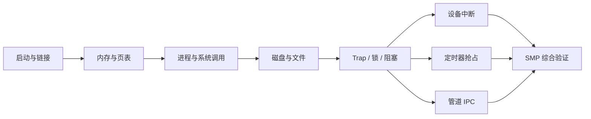

# RVKernel Lab 教程：从启动到多核并发

这门实践课程围绕一个问题展开：一个用户程序如何在自己地址空间里运行、等待设备、与其他进程通信，并和它们共享多个 CPU？

课程以本仓库当前实现为可运行参考，基础知识承接 Seiya Nuta 的 [Operating System in 1,000 Lines](https://operating-system-in-1000-lines.vercel.app/en/)，后半部分讲解设备中断、定时器抢占、管道和 SMP 扩展。这里的章节编号属于本项目，不对应原教程编号。

## 适合谁

需要能读懂 C 指针、结构体、位运算和简单函数调用，能在终端执行命令。不要求提前会写内核汇编。第一次遇到汇编时，先追踪“保存了什么、谁恢复它”，再理解每条指令。

建议每课完成四件事：运行一次、画一条调用链、修改一个小点、保存验证证据。学习速度以能解释验收题为准。

## 课程目录

| 阶段 | 章节 | 学完能做什么 |
| --- | --- | --- |
| 入门 | [00 环境与第一次启动](00-getting-started.md) | 区分宿主机、QEMU、固件、内核和应用 |
| 基础 | [01 启动、链接与输出](01-boot.md) | 从 ELF 入口追到第一个字符 |
| 基础 | [02 物理内存与页表](02-memory.md) | 区分分配物理页和建立虚拟映射 |
| 基础 | [03 进程、用户态与系统调用](03-processes.md) | 跟踪一次 ecall 及上下文恢复 |
| 基础 | [04 磁盘与文件系统](04-filesystem.md) | 把文件操作追到块请求 |
| 桥梁 | [05 Trap、锁与阻塞唤醒](05-traps-and-sleep.md) | 解释中断现场和 lost wakeup |
| 扩展一 | [06 设备中断](06-interrupts.md) | 串联 PLIC、设备确认和进程唤醒 |
| 扩展二 | [07 定时器与抢占](07-preemption.md) | 证明不主动 yield 的任务能被切走 |
| 扩展三 | [08 具名管道 IPC](08-pipes.md) | 处理有限缓冲、short I/O、EOF 和断管 |
| 扩展四 | [09 多核启动与调度](09-smp.md) | 解释每核状态、共享 PCB 锁与 IPI |
| 综合 | [10 验证与毕业实验](10-capstone.md) | 用证据说明能力、边界与改动效果 |

推荐按顺序学习。已有基础可从 05 开始；07 的完整自测使用 08 的管道作为测试同步工具，可先把它理解为传递单字节消息的通道。



## 两种学习方式

**阅读当前实现。** 每章提供函数名、源码链接和终端命令，在完整内核上做局部实验。这是当前课程已经提供的方式。实验任务与参考答案分开呈现，先做预测再看提示。

**回看历史。** 基础部分保留章节提交，可以只读比较：

```sh
git log --reverse --oneline
git show 6c3b96c:kernel.c                # 引导阶段
git show a907bb5:kernel.c               # 页表阶段
git show 6f2b063:kernel.c               # 文件系统基线
git diff 6f2b063 -- kernel.c kernel.h   # 基线到当前扩展
```

后一个命令包含工作区尚未提交的改动。四项扩展尚未拆成独立教学提交，不要把当前章节当作可以逐章 checkout 的构建版本。历史代码的工具链兼容性也不等同于当前回归结果。

## 实验约定

- 在当前可运行代码上练习；修改前记录原值，实验后手动恢复自己改动的片段。
- 同一时间只运行一套构建或 QEMU；它们共享根目录镜像和输出文件。
- 每次源码修改后执行 `bash run.sh`，涉及并发再执行 `python3 scripts/smoke.py`。
- `selftest` 是内置测试，不是独立 shell 子命令集合；当前不能输入 `selftest timer` 等参数。
- 实验中的“预期”是验收标准，不表示这些新增练习已由维护者逐一实测。
- 不以一次通过证明没有竞态，不以计数器大小声称性能优劣。

## 阅读资料与来源

[原教程](https://operating-system-in-1000-lines.vercel.app/en/)及[示例源码](https://github.com/nuta/operating-system-in-1000-lines)是基础实现参考；文字与示例源码的许可说明见[项目首页](../../README.md)。扩展章节依据当前仓库代码讲解，不是原作者提供的后续章节。

需要深入核对固件接口时阅读 [RISC-V SBI 官方规范仓库](https://github.com/riscv-non-isa/riscv-sbi-doc)，查找 TIME、HSM、IPI。项目中的硬件地址、hart 范围和时钟频率是当前实现的配置选择，不是所有 RISC-V 平台的通用常量。

完成课程后可阅读[完整实现导读](../IMPLEMENTATION_AND_INTERVIEW_GUIDE.md)、[验证记录](../VALIDATION.md)和[演示流程](../DEMO.md)。
